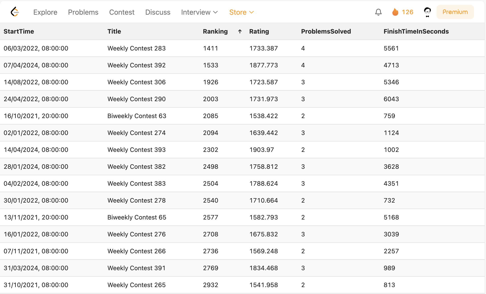

# LeetCodeContestTable
> A better way to see your progress in LeetCode contests

## Why this extension
* It's really painful to do proper analysis of how am I progressing over time in contests
* Eg. If I want to know that when I was able to complete all problems, or when I had a better rank etc.

## Usage
* Open any leetcode page (profile, contest, problems, discussion etc)
* Click the extension icon to show your contest data table
* Click the icon again to hide the table

## Installation from store
* Get this extension from [chrome web store](https://chromewebstore.google.com/detail/leetcodecontesttable/bjoebpnpgokmpdnejdnaolnlbkbkfbml)

## Manual Installation
* Clone this repo
* Go to <a href="chrome://extensions">chrome://extensions</a>
* Enable <a href="https://www.mstoic.com/enable-developer-mode-in-chrome/">Developer mode</a> by toggling the switch on top right corner
* Click **"Load unpacked"**
* Select the entire LeetCodeContestTable folder